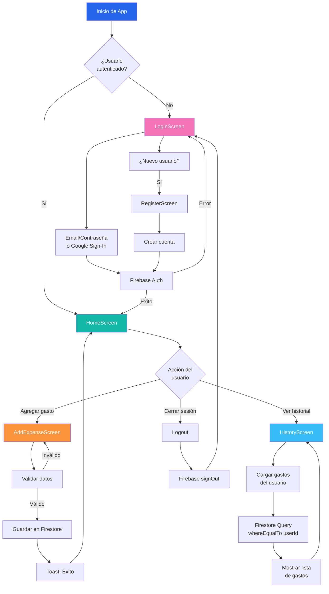

# Foro 2 - Desarrollo de Software para Móviles

## Información del Proyecto

**Universidad:** Universidad Don Bosco  
**Materia:** Desarrollo de Software para Móviles (DSM941)  
**Proyecto:** Foro 2 
**Grupo:** #3  
**Estudiante:** Isidro Alexander Marroquín Echeverría  
**Correo:** isidro.marroquin@udb.edu.sv  
**Carnet:** ME221443  
**Fecha:** Mayo 2026


## Descripción del Proyecto

Aplicación Android de gestión de gastos personales** construida con Jetpack Compose y Firebase. Permite a los usuarios registrar, categorizar y visualizar sus gastos de forma intuitiva y segura.

---

## 📋 Descripción General

ControlGastosApp es una solución móvil para la gestión personal de finanzas. Proporciona:

- **Autenticación segura** con Firebase (email/contraseña y Google Sign-In)
- **Registro de gastos** con categorización automática
- **Dashboard intuitivo** con estadísticas en tiempo real
- **Historial detallado** de transacciones
- **Sincronización en la nube** con Firestore
- **Interfaz moderna** con Material Design 3

---

## Arquitectura del Sistema

### Stack Tecnológico

| Componente | Tecnología | Versión |
|---|---|---|
| **Lenguaje** | Kotlin | 2.2.10 |
| **UI Framework** | Jetpack Compose | Material Design 3 |
| **Backend** | Firebase | 34.12.0 |
| **Autenticación** | Firebase Auth + Google Sign-In | 21.2.0 |
| **Base de Datos** | Firestore | Real-time NoSQL |
| **Navegación** | Jetpack Navigation Compose | 2.9.5 |
| **Compilación** | Gradle | 9.2.1 |
| **SDK** | Android | Min: 24, Target: 36 |

### Estructura del Proyecto

```
app/src/main/java/com/tuapp/gastos/
├── components/              # Componentes reutilizables
│   ├── AppButton.kt        # Botón estándar
│   ├── AppTextField.kt     # Campo de texto
│   ├── AuthCard.kt         # Tarjeta para formularios
│   └── ScreenContainer.kt  # Contenedor base
├── screens/                 # Pantallas principales
│   ├── LoginScreen.kt      # Autenticación
│   ├── RegisterScreen.kt   # Registro de usuario
│   ├── HomeScreen.kt       # Dashboard
│   ├── AddExpenseScreen.kt # Agregar gasto
│   └── HistoryScreen.kt    # Historial
├── navigation/              # Navegación
│   ├── AppNavigation.kt    # Configuración de rutas
│   └── Routes.kt           # Constantes de rutas
├── models/                  # Modelos de datos
│   └── Gasto.kt            # Estructura de gasto
├── ui/theme/                # Tema y estilos
│   ├── Color.kt            # Paleta de colores
│   ├── Theme.kt            # Configuración de tema
│   └── Type.kt             # Tipografía
└── MainActivity.kt          # Punto de entrada
```

---

## Flujo de Datos del Sistema



---

## Pantallas y Funcionalidades

### 1. **LoginScreen** - Autenticación
- Inicio de sesión con email/contraseña
- Google Sign-In integrado
- Validación de campos
- Navegación a registro
- Manejo de errores con Snackbar

### 2. **RegisterScreen** - Registro
- Creación de cuenta
- Validaciones:
  - Campos requeridos
  - Contraseña mínimo 6 caracteres
  - Confirmación de contraseña
- Navegación a login

### 3. **HomeScreen** - Dashboard
- Saludo personalizado
- Total acumulado de gastos
- Estadísticas (cantidad de gastos y categorías)
- Botones de acción rápida
- Cierre de sesión

### 4. **AddExpenseScreen** - Registrar Gasto
- Formulario con campos:
  - Nombre del gasto
  - Monto (decimal)
  - Categoría (dropdown)
- Categorías disponibles:
  - 🍔 Comida
  - 🚗 Transporte
  - 🛍️ Compras
  - 🔧 Servicios
  - 🎬 Entretenimiento
  - 🏥 Salud
  - 📚 Educación
  - 📌 Otros
- Validaciones y guardado en Firestore

### 5. **HistoryScreen** - Historial
- Lista de todos los gastos
- Total acumulado
- Elementos con:
  - Ícono de categoría
  - Nombre y categoría
  - Fecha (dd/MM/yyyy)
  - Monto
- Estado vacío personalizado
- Carga asincrónica

### 6. **AboutScreen** - Información del Proyecto
- Derechos de autor
- Información del estudiante
- Descripción del proyecto
- Características principales
- Tecnologías utilizadas
- Scroll vertical para contenido extenso

---

## 🗄️ Modelo de Datos - Firestore

### Colección: `gastos`

```json
{
  "id": "auto-generated",
  "nombre": "Almuerzo",
  "monto": 25.50,
  "categoria": "Comida",
  "fecha": "10/05/2026",
  "userId": "firebase-uid-del-usuario"
}
```

**Índices de Consulta**:
- `userId` (para filtrar gastos por usuario)
- `fecha` (para ordenar cronológicamente)

---

## Sistema de Diseño

### Paleta de Colores

| Elemento | Color | Hex |
|---|---|---|
| Primario | Púrpura vibrante | #7C3AED |
| Secundario | Rosa/Magenta | #EC4899 |
| Fondo | Fondo muy claro púrpura | #FAF5FF |
| Superficie | Blanco | #FFFFFF |
| Error | Rojo vibrante | #EF4444 |
| Éxito | Verde esmeralda | #10B981 |

### Colores por Categoría

| Categoría | Color | Hex |
|---|---|---|
| Comida | Rojo coral | #FF6B6B |
| Transporte | Índigo profundo | #4F46E5 |
| Compras | Cian | #06B6D4 |
| Servicios | Púrpura | #8B5CF6 |
| Entretenimiento | Ámbar | #F59E0B |
| Salud | Verde agua | #14B8A6 |
| Educación | Rosa | #EC4899 |
| Otros | Índigo | #6366F1 |

### Tipografía

- **Título Grande**: 24sp, Bold
- **Cuerpo Grande**: 16sp
- **Etiqueta Mediana**: 14sp, Medium

---

## Seguridad y Autenticación

### Firebase Authentication
- **Email/Contraseña**: Validación de Firebase
- **Google Sign-In**: OAuth 2.0 con ID token
- **Gestión de Sesión**: Automática con `FirebaseAuth.currentUser`

### Firestore Security
- **Aislamiento de Datos**: Cada usuario solo ve sus gastos
- **Filtrado por UID**: `whereEqualTo("userId", currentUser.uid)`
- **Credenciales**: Almacenadas en `google-services.json`

---

## Cómo Ejecutar el Proyecto

### Requisitos Previos
- Android Studio (versión reciente)
- JDK 11 o superior
- Android SDK 36 (target)
- Cuenta de Firebase configurada

### Pasos de Instalación

1. **Clonar el repositorio**
   ```bash
   git clone <https://github.com/marroquin9953/DSM941-Foro2.git>
   cd DSM941-FORO2
   ```

2. **Configurar Firebase**
   - Crear proyecto en [Firebase Console](https://console.firebase.google.com)
   - Descargar `google-services.json`
   - Colocar en `app/google-services.json`
   - Habilitar:
     - Authentication (Email/Password y Google)
     - Firestore Database

3. **Configurar Google Sign-In**
   - En Firebase Console → Authentication → Google
   - Obtener Web Client ID
   - Actualizar en `app/src/main/res/values/strings.xml`:
     ```xml
     <string name="default_web_client_id">YOUR_WEB_CLIENT_ID</string>
     ```

4. **Compilar y ejecutar**
   ```bash
   # Compilar
   ./gradlew build
   
   # Ejecutar en emulador o dispositivo
   ./gradlew installDebug
   ```

### Alternativa: Android Studio
1. Abrir proyecto en Android Studio
2. Sincronizar Gradle
3. Ejecutar en emulador (Shift + F10)

---

## 📦 Dependencias Principales

```gradle
// Firebase
implementation(platform("com.google.firebase:firebase-bom:34.12.0"))
implementation("com.google.firebase:firebase-auth")
implementation("com.google.firebase:firebase-firestore")

// Google Sign-In
implementation("com.google.android.gms:play-services-auth:21.2.0")
implementation("com.google.android.libraries.identity.googleid:googleid:1.1.1")

// Jetpack Compose
implementation(platform(libs.androidx.compose.bom))
implementation(libs.androidx.compose.material3)
implementation(libs.androidx.compose.ui)
implementation(libs.androidx.activity.compose)

// Navegación
implementation("androidx.navigation:navigation-compose:2.9.5")

// Credenciales
implementation("androidx.credentials:credentials:1.3.0")
implementation("androidx.credentials:credentials-play-services-auth:1.3.0")
```

---

## 🔧 Variables de Entorno y Configuración

### Archivos de Configuración

#### 1. `google-services.json` (Requerido)
**Ubicación**: `app/google-services.json`

Descargado de Firebase Console. Contiene:
- Project ID
- API Keys
- Client IDs

**IMPORTANTE**: No commitear este archivo. Agregar a `.gitignore`:
```
app/google-services.json
```

#### 2. `strings.xml` - Web Client ID
**Ubicación**: `app/src/main/res/values/strings.xml`

```xml
<string name="default_web_client_id">YOUR_WEB_CLIENT_ID_HERE</string>
```

Obtener de Firebase Console → Project Settings → Web Client ID

#### 3. `build.gradle.kts` - Configuración de Compilación
**Ubicación**: `app/build.gradle.kts`

```gradle
android {
    namespace = "com.tuapp.gastos"
    compileSdk = 36
    
    defaultConfig {
        applicationId = "com.tuapp.gastos"
        minSdk = 24
        targetSdk = 36
        versionCode = 1
        versionName = "1.0"
    }
}
```

---

## 🧪 Testing

### Pruebas Unitarias
```bash
./gradlew test
```

### Pruebas de Instrumentación
```bash
./gradlew connectedAndroidTest
```

---

## 📊 Diagrama de Entidades - Firestore

```
┌─────────────────────────────────────┐
│         Colección: gastos           │
├─────────────────────────────────────┤
│ Documento (Auto-generado)           │
├─────────────────────────────────────┤
│ • id: String (PK)                   │
│ • nombre: String                    │
│ • monto: Double                     │
│ • categoria: String                 │
│ • fecha: String (dd/MM/yyyy)        │
│ • userId: String (FK → Firebase)    │
└─────────────────────────────────────┘
         ↓ Índice
    whereEqualTo("userId", uid)
```

---

## 🎯 Casos de Uso Principales

### 1. Registro de Usuario
```
Usuario → Completa formulario → Validación → Firebase Auth → Éxito → HomeScreen
```

### 2. Agregar Gasto
```
Usuario → HomeScreen → "Agregar gasto" → AddExpenseScreen → Completa formulario 
→ Validación → Firestore.add() → Toast → HomeScreen
```

### 3. Ver Historial
```
Usuario → HomeScreen → "Ver historial" → HistoryScreen → Firestore Query 
→ Mapeo a objetos → LazyColumn renderiza
```

---

## 🚨 Manejo de Errores

| Escenario | Manejo |
|---|---|
| Campos vacíos | Toast/Snackbar |
| Contraseña < 6 caracteres | Snackbar |
| Contraseñas no coinciden | Snackbar |
| Monto inválido | Toast |
| Error de Firebase | Toast/Snackbar con mensaje |
| Sin conexión | Firestore maneja automáticamente |

---

## 📄 Licencia

Este proyecto está bajo licencia MIT.

---
